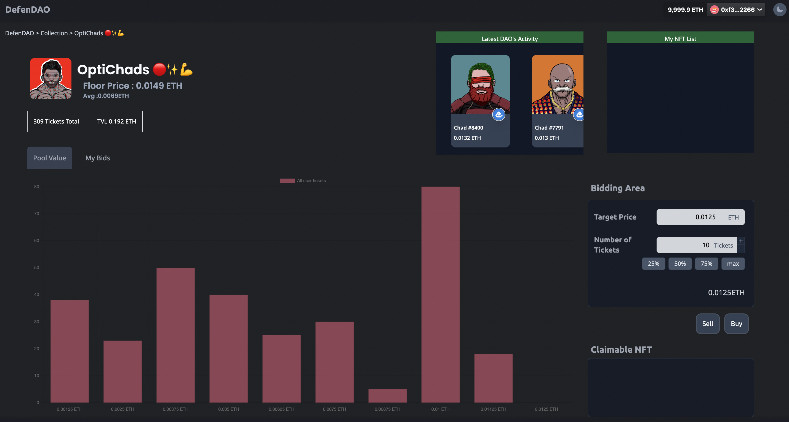

# DeFenDAO

_Note: this code is not audited and should not be used in production environment._

## Summary

DeFenDAO aims to provide a tool for NFT communities to boost engagement and defend prices increase by enabling providing partial buy liquidity. It also aims to increase liquidity in the overall NFT market.

## Demo

- [Website](https://hackathon-dcyn.vercel.app/)
- [Video](https://www.youtube.com/watch?v=xiJmm0miDmc)
- [Project slides deck](./resources/DeFendDAO.pdf)

## Problem

### NFT holders' perspective

As the NFT market experiences a downturn, NFT collections are experiencing a death spiral of lower floor prices -> lower bids -> lower confidence -> lower floor prices. But having `more buy bids at higher prices` can break this chain.

### NFT buyers' perspective

Buyers may want to snipe a collection at a price lower than the current floor price. Opensea supports this through "collection offers", but they do not support `making partial bids`.

## Solution

Create a contract that allows users to provide liquidity for collections at the price lower than the current floor price (unit for liquidity is currently mininum 1/10th of NFT price). If there is enough liquidity to buy an NFT on this contract and there is a sell order with a matching price available on Opensea, anyone can call the contract `execute` function, which will buy the NFT.

We also added a lottery system for selecting the recipient of the NFT. Liquidity providers will have an opportunity to win the NFT depending on the percentage of liquidity they provided. (e.g. if 10 people provided 1/10th of liquidity, they will all have equal chances of winning the NFT) This lottery system was added to make the process more fun for participants and lower the barrier to entry.

### Frontend

https://github.com/2022DefenDAO/front


### Contracts

Expected node version is >= 16.0.0

1. Install and build

```shell
yarn
yarn build
```

2. Run unit test

```shell
yarn workspace contracts test
```

## Challenges

### 1. OpenSea API not working for Optimism network

=> _Used orders that had been already executed on a fork of the Optimism network (pre-execution)_

### 2. Seaport fulfill functions not working because of signature verification

=> _Used validate function before fulfill function to bypass signature verification_

### 3. Seaport validate functions not working for certain order types (out of BASIC_ORDER, ORDER, ADVANCED_ORDER types, only ORDER type works)

=> _Converted BASIC_ORDER, ADVANCED_ORDER types to ORDER type._

## Future work

- Dynamic price units
- Integrate floor price oracles
- Ticket purchase and NFT claim fees
- Executor incentives
- Ticket reserve yields
- Support multiple NFT marketplaces
